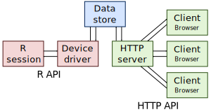
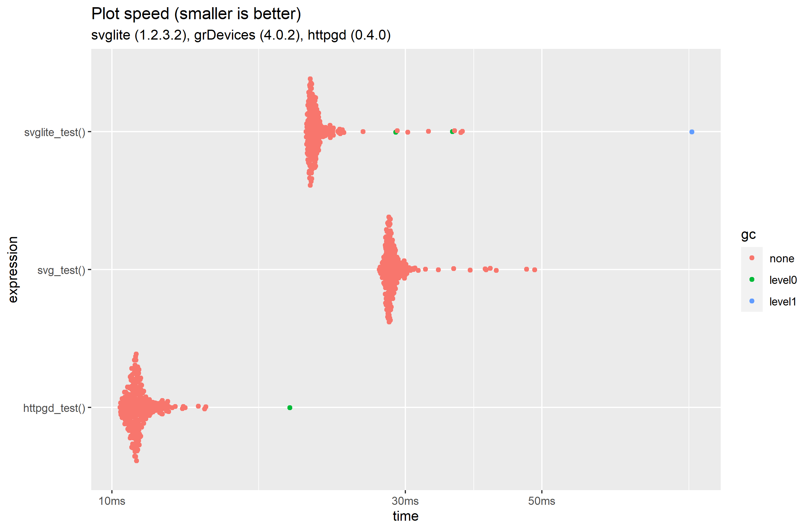
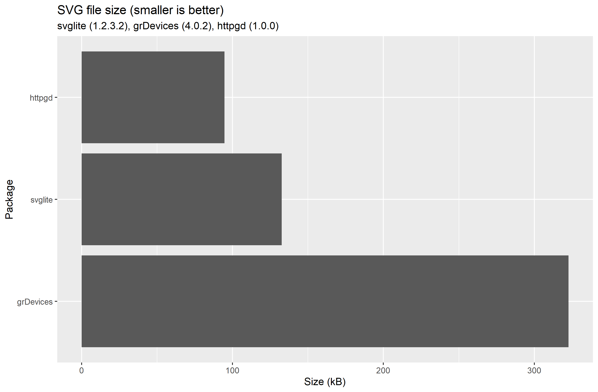

# httpgd 

[](https://github.com/nx10/httpgd/actions)

Asynchronous http server graphics device for R.

## Features

* Fast high quality plots
* Stateless HTTP/Websocket SVG API
* Plot resizing
* Plot history
* HTML/JavaScript client (TypeScript module)
* Multiple concurrent clients

## Demo


## Installation

```R
devtools::install_github("nx10/httpgd")
```

Depends on `Rcpp`, `later` and `systemfonts`.

SVG rendering (especially font rendering) based on `svglite` (<https://github.com/r-lib/svglite>).

Built using [Boost Beast](https://github.com/boostorg/beast), [Belle](https://github.com/octobanana/belle) and [fmt](https://github.com/fmtlib/fmt).

See [system requirements](#System-requirements) for troubleshooting.

## Usage

Initialize graphics device and start server with:

```R
hgd()
```

Copy the displayed link in the browser or call

```R
hgd_browse()
```

to open a browser window automatically.

Plot anything.

```R
x = seq(0, 3 * pi, by = 0.1)
plot(x, sin(x), type = "l")
```

Every plotting library will work.

```R
library(ggplot2)
ggplot(mpg, aes(displ, hwy, colour = class)) +
  geom_point()
```

Stop the server with:

```R
dev.off()
```

### Keyboard shortcuts

| Keys | Result |
|:----:|--------|
| <kbd>&#8592;</kbd> <kbd>&#8594;</kbd> <kbd>&#8593;</kbd> <kbd>&#8595;</kbd> | Navigate plot history. |
| <kbd>N</kbd> | Jump to the newest plot. |
| <kbd>del</kbd> / <kbd>D</kbd> | Delete plot. |
| <kbd>+</kbd> / <kbd>-</kbd> | Zoom in and out. |
| <kbd>0</kbd> | Reset zoom level. |
| <kbd>S</kbd> | Download plot as SVG. |
| <kbd>R</kbd> | Download plot as PNG. |
| <kbd>C</kbd> | Clear all plots. |

### API



httpgd can be accessed both from R and from HTTP:

* [R API](docs/RApi.md)
* [Web API](docs/WebApi.md)

## Benchmark

There are currently no other network graphics devices for comparison, httpgd can be used in offline mode (with `hgd(webserver = FALSE)`) to compare it with conventional SVG graphics devices.

The [benchmark from svglite](https://github.com/r-lib/svglite/blob/master/README.md) has the following results:

<details>

<summary>Code</summary>

```R
library(svglite)
library(httpgd)
set.seed(1234)
x <- runif(1e3)
y <- runif(1e3)
tmp1 <- tempfile()
tmp2 <- tempfile()
tmp3 <- tempfile()
svglite_test <- function() {
  svglite(tmp1)
  plot(x, y)
  dev.off()
}
svg_test <- function() {
  svg(tmp2, onefile = TRUE)
  plot(x, y)
  dev.off()
}
httpgd_test <- function() {
  hgd(webserver = FALSE)
  plot(x, y)
  hgd_svg(file = tmp3)
  dev.off()
}
ben <-
  bench::mark(httpgd_test(), svglite_test(), svg_test(), iterations = 250)
```

[See full code](docs/benchmark.R)

</details>

|expression     |    min| median|  itr/sec| mem_alloc|    gc/sec| n_itr| n_gc| total_time|
|:--------------|------:|------:|--------:|---------:|---------:|-----:|----:|----------:|
|httpgd_test()  | 10.2ms| 10.8ms| 91.43165|     361KB| 0.7373520|   248|    2|      2.71s|
|svglite_test() | 20.3ms| 21.4ms| 46.29561|     593KB| 0.5622948|   247|    3|      5.33s|
|svg_test()     | 27.2ms| 28.3ms| 35.15964|     126KB| 0.1412034|   249|    1|      7.08s|

*Package versions: httpgd (1.0.0), svglite (1.2.3.2), grDevices (4.0.3)*

 


## System requirements

`libpng` and X11 are required on unix like systems (e.g. Linux, macOS).

### macOS

If `libpng` is missing install it via:

```sh
brew install libpng
```

If X11 is missing the error message will include the text:

```sh
unable to load shared object [...] systemfonts/libs/systemfonts.so [...]
```

Install [XQuartz](https://www.xquartz.org/).
(see: <https://github.com/r-lib/systemfonts/issues/17>)

## Help welcome

The various components of httpgd are written in C++, R and TypeScript. We welcome contributions of any kind.

Other areas in need of improvement are: Testing, documentation, net security and continuous integration.

## License

This project is licensed GPL v2.0.

The HTML client includes [Material Design icons by Google](https://github.com/google/material-design-icons) which are licensed under the [Apache License Version 2.0](https://www.apache.org/licenses/LICENSE-2.0.txt).
